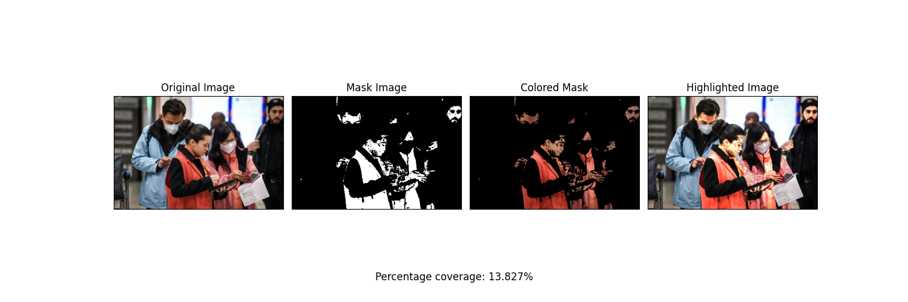

# Color Detection and Analysis in Images

## Introduction
The provided Python script is designed to detect and analyze specific HSV color ranges within images. It visualizes and highlights the color coverage, outputting the percentage coverage. The algorithm leverages the OpenCV and Matplotlib libraries for image processing and visualization.

## Algorithm Overview
1. **Image Loading:** The script reads an image file specified by the user using OpenCV's `cv.imread` function.
2. **Color Space Conversion:** The image is converted from the default RGB color space to the HSV (Hue, Saturation, Value) color space using `cv.cvtColor`.
3. **Color Range Definition:** The user specifies a color range in HSV format, defining the lower and upper bounds for hue, saturation, and value.
4. **Mask Creation:** A binary mask is created using `cv.inRange`, isolating pixels within the specified color range.
5. **Color Region Extraction:** The color region is obtained by applying a bitwise AND operation between the original image and the mask, using `cv.bitwise_and`.
6. **Highlighted Image Creation:** The script generates a highlighted image by combining the original image and the color region using `cv.addWeighted`.
7. **Coverage Percentage Calculation:** The percentage coverage of the specified color range is calculated by comparing the number of colored pixels to the total number of pixels in the image.
8. **Visualization and Saving:** Matplotlib is used to create a subplot displaying the original image, mask image, colored mask, and highlighted image – the final result. The plot is saved as a PNG file with the percentage coverage at the bottom.

## Usage
- Users can input the path to the image (`img_path`) and define the desired color range (`color_range`) in HSV format.
- The script processes the image, creates visualizations, and saves the results in the "results" directory.

## Visualizations
- The script generates a subplot with four images: the original image, the mask image, the colored mask, and the highlighted image.
- The percentage coverage of the specified color range is displayed at the bottom.

## Adjustments
- Users can modify the color range parameters and image path for different color detection scenarios.
- Adjustments to the figure size, spacing between subplots, and other visual parameters can be made to suit specific preferences.
